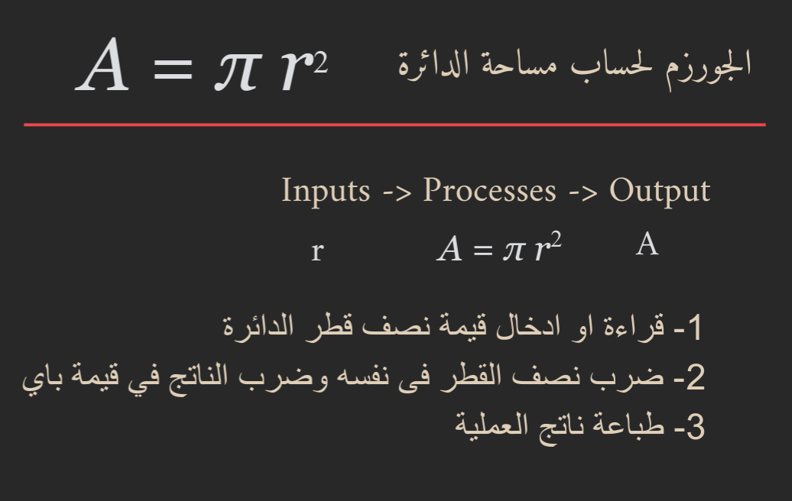
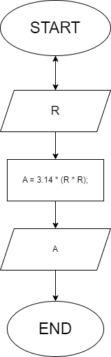
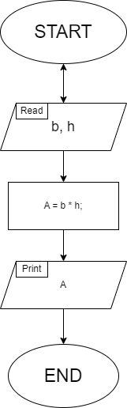
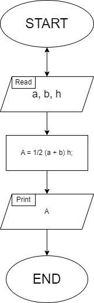

# 01-Circle-area

_write an algorithm to calculate the area of a circle._

> [!IMPORTANT]
> To calculate the circle area, we will use the formula **A = π r2**

### Algorithm

1. Read the input from the user (radius).
2. Multiply the radius by itself and multiply the value by pi.
3. Print the output (A).

> 

### Flow Chart

# 02-ex-parallelogram-area

_write an algorithm to calculate the area of a parallelogram._

> [!IMPORTANT]
> To calculate the parrallelogram area, we will use the formula **A = b h**. 
> b = base, h = height.

### Algorithm

1. Read the input from the user (base and height).
2. Multiply the inputs.
3. Print the output (A).

### Flow Chart

# 03-ex-trapezoid-area

_write an algorithm to calculate the area of a trapezoid._

> [!IMPORTANT]
> To calculate the trapezoid area, we will use the formula **A = 0.5(a + b) h**. 
> a = base one, b = base two, h = height.

### Algorithm

1. Read the input from the user (the bases and height).
2. Multiply the inputs and do the calculations.
3. Print the output (A).

### Flow Chart

