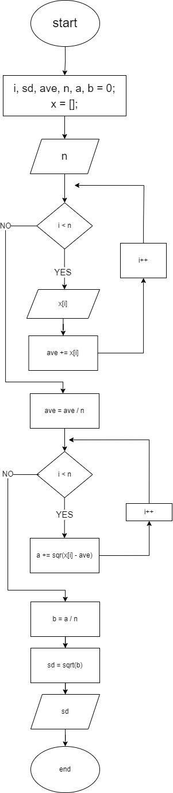

# 01-Standard-Deviation
*write an algorithm to calculate the Standard Deviation.*
> [!IMPORTANT]
> To calculate the circle area, we will use the formula 

### Algorithm
1. Allocate space in the memory for x array of numbers, ave, sum(a) and N.
2. Enter the value of N.
3. Enter the x values N number of times.
4. Calculate the ave.
5. The sumtion ( ∑ ( Xi − μ )2 )
6. The division process
7. The Square root process
8. Print the result

### Flow Chart

