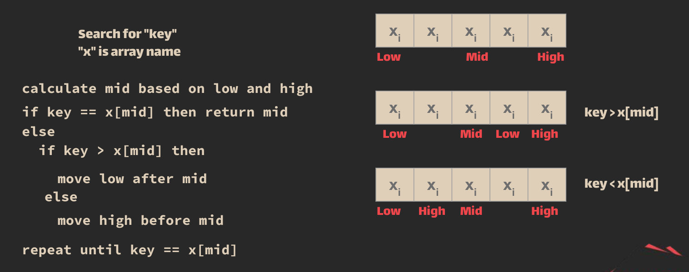
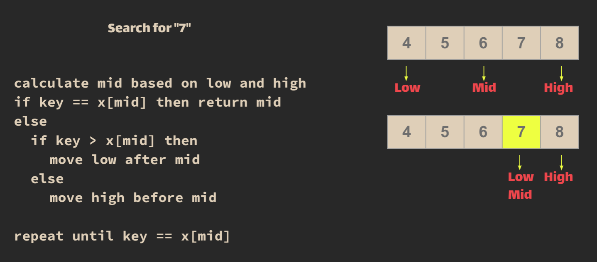
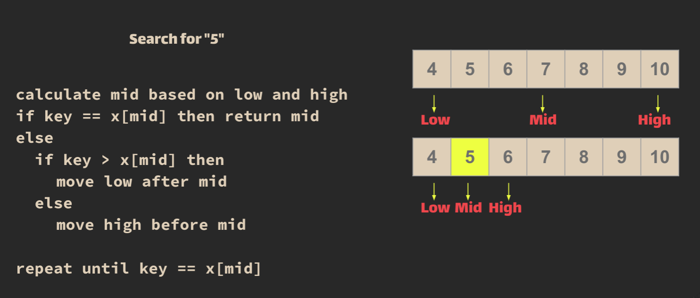

## Binary Search

> is a searching algorithm used in a sorted array by repeatedly dividing the search interval in half. The idea of binary search is to use the information that the array is sorted and reduce the time complexity to O(log N).

> ### <mark>**ONLY FOR SORTED DATA.**</mark>

> Binary search is a search algorithm used to find the position of a target value within a sorted array. It works by repeatedly dividing the search interval in half until the target value is found or the interval is empty. The search interval is halved by comparing the target element with the middle value of the search space.    
