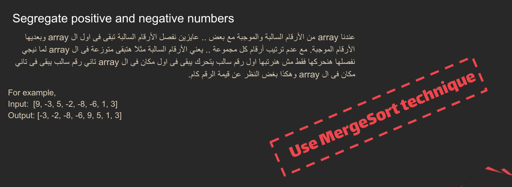
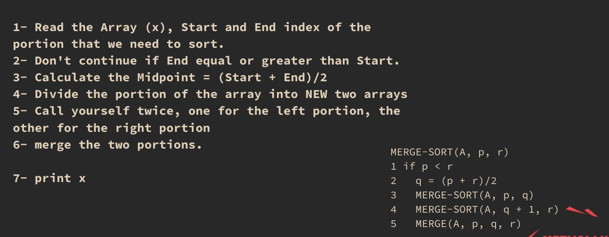
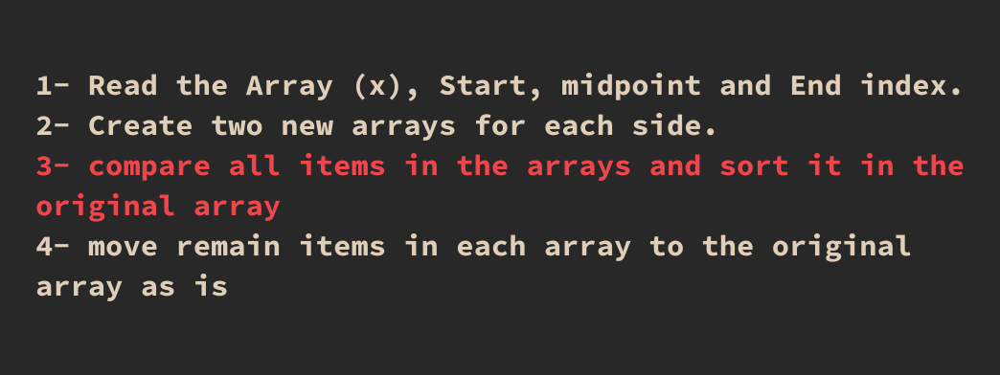
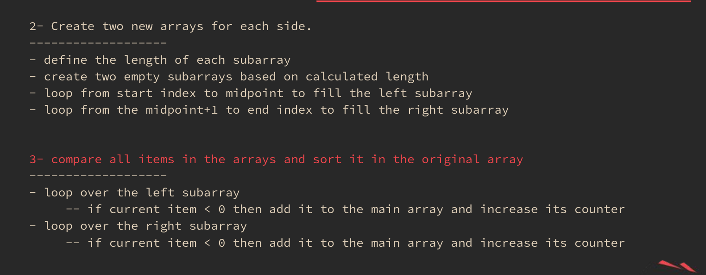
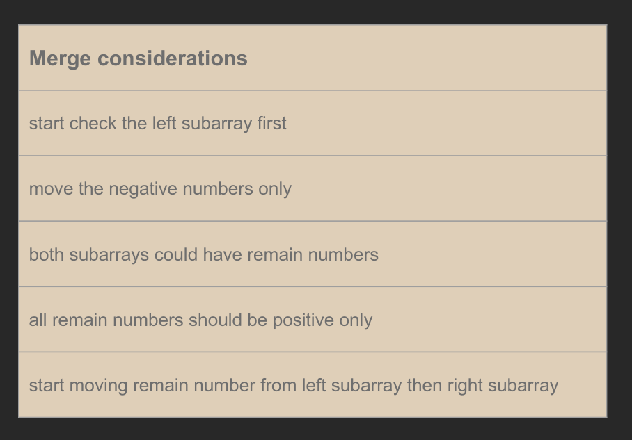
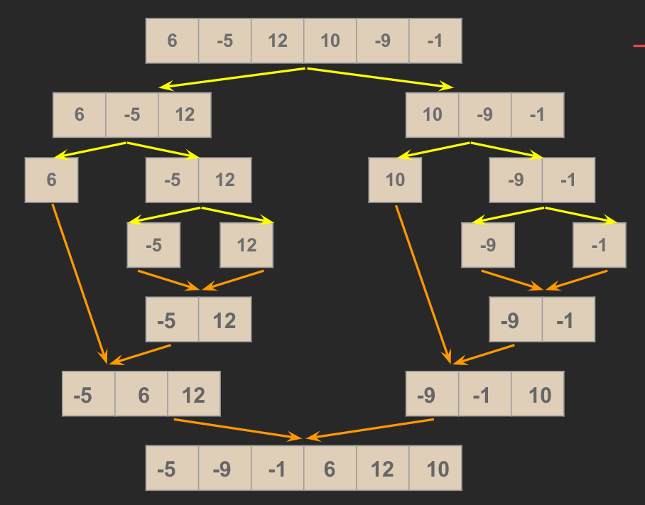

# Segregate Positive and Negative Numbers

>      

## Notes

> -> The best solution is not always the one with the best complexity class.  
> -> The most convenient solution is not always the one with the best complexity class.

> • Always start by writing pseudocode or outlining a guide for your solution.  
> • Include considerations for how the code will be structured.  
> • The focus during actual coding should be on implementation details such as loop types and logic.  
> • However, the overall structure and placement of loops should already be well-defined in your pseudocode or plan.
