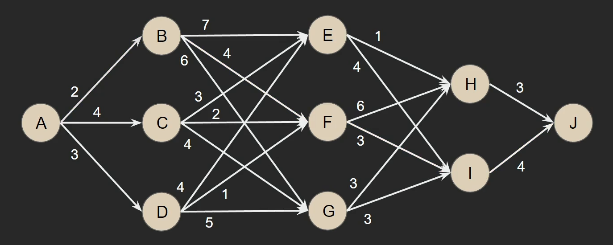
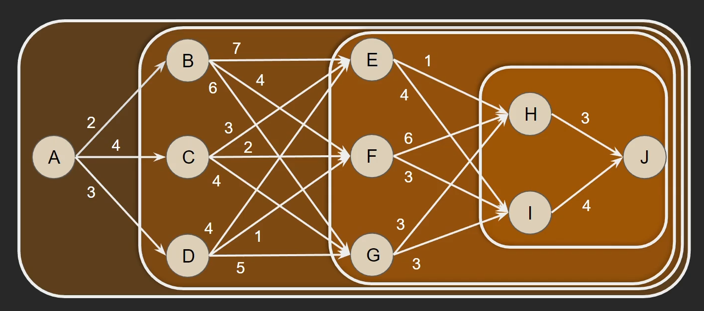
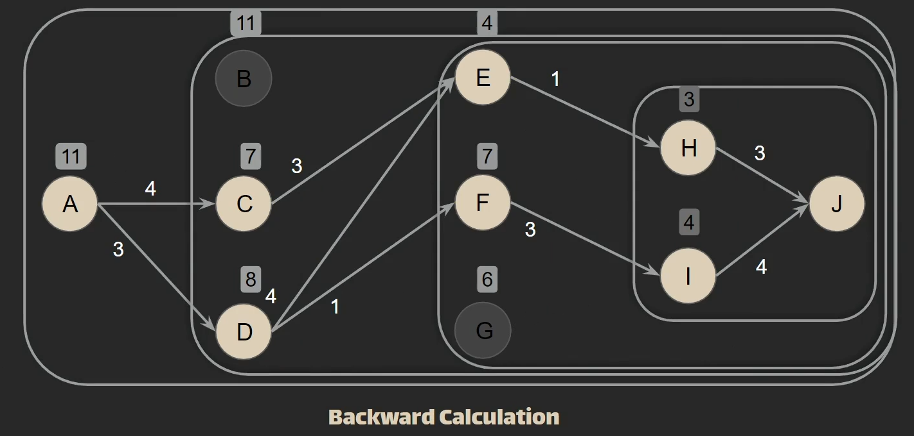
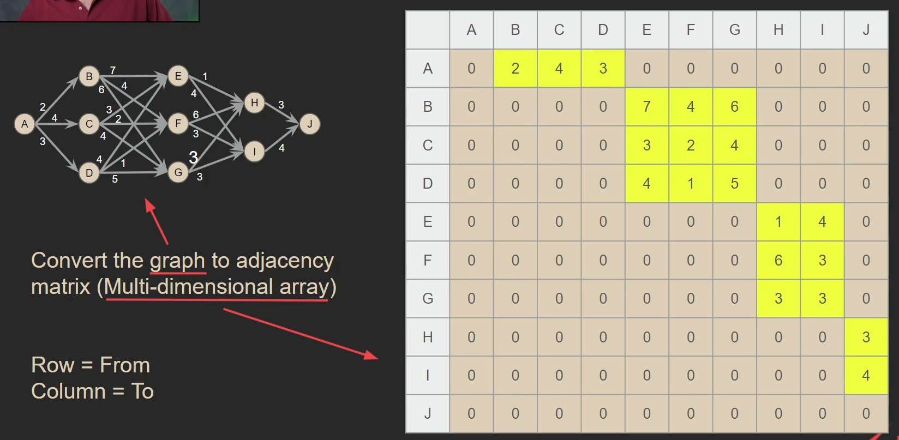
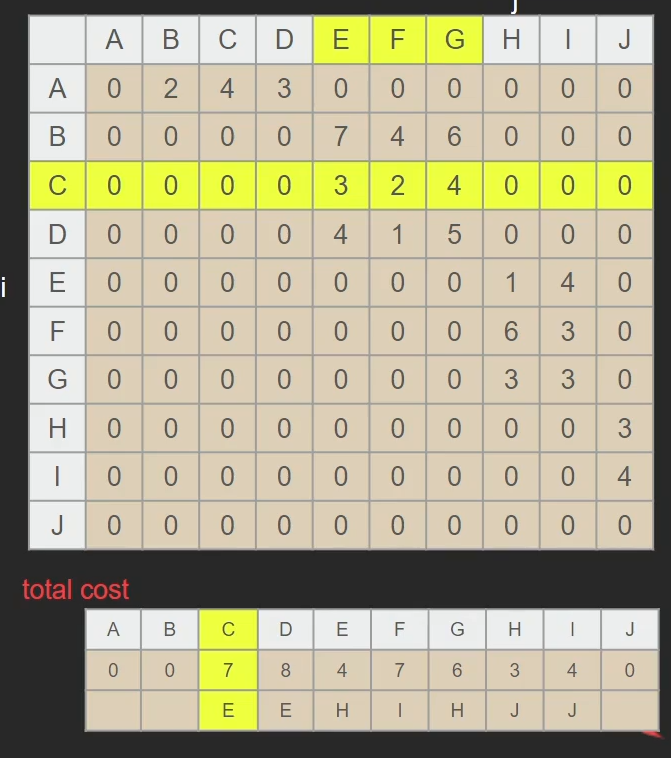
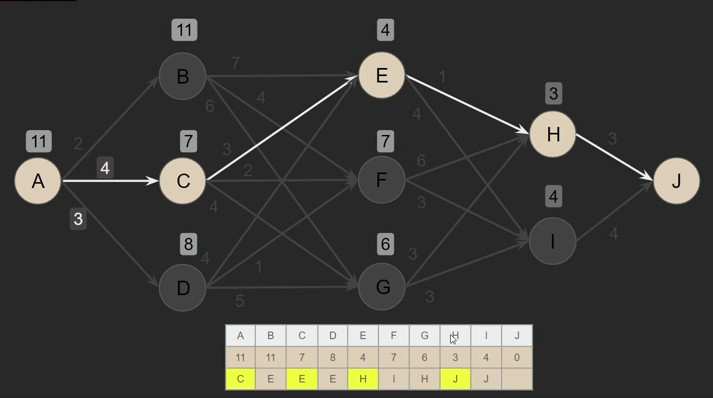

## Dynamic Programing

> Dynamic Programming is a technique used to optimize the solution of complex problems by breaking them down into simpler sub-problems. This method minimizes the number of calculations required by storing and reusing the results of previously solved sub-problems.

## What is Stagecoach?

> A Stagecoach is a traditional American horse-drawn vehicle used for transportation. In the context of this algorithm, imagine a Stagecoach traveling from point A to point B, with various roads (or paths) it can traverse. Each road has a specific cost associated with it. The goal is to determine the most cost-effective route from point A to point B.

## How Stagecoach Algo approach to solve this problem?

> The Stagecoach Algorithm employs Dynamic Programming to efficiently find the minimum cost path. By breaking down the problem into smaller sub-problems and solving each one only once, Dynamic Programming avoids redundant calculations. This approach leverages previously computed results to build up the solution, ensuring that the overall computational effort is minimized.

