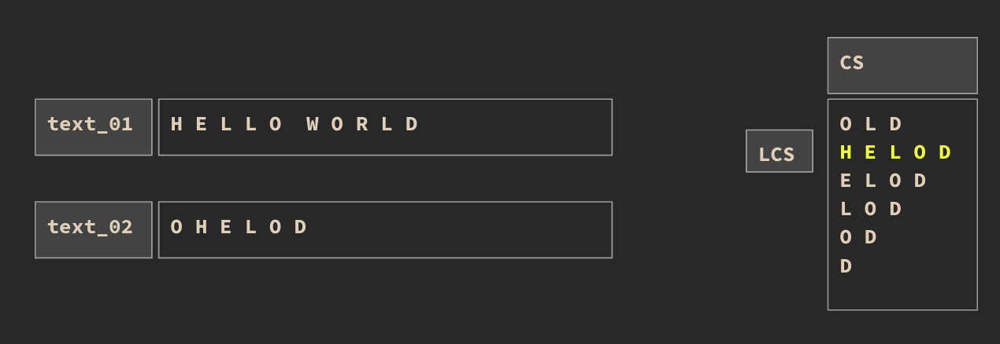
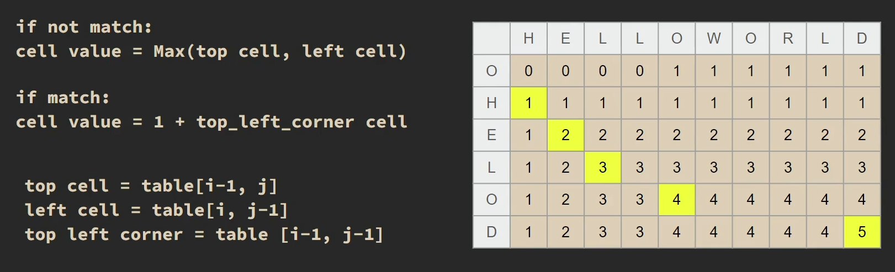

# Longest Common Subsequence

> The problem involves finding the longest subsequence that is common to two sequences (strings or arrays)
> 

> [!NOTE]
> Not Substring!

> unlike substrings, subsequences are not required to occupy consecutive positions within the original sequences.

## How it works?

> 
