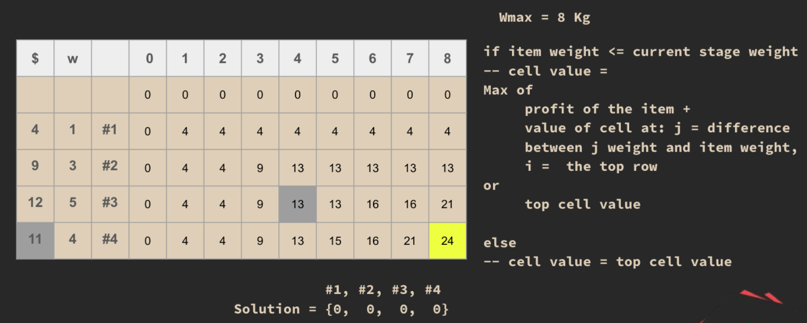
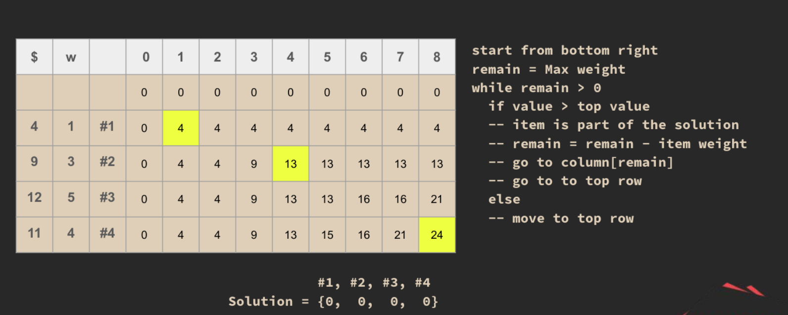

## 0/1 Knapsack Problem

> 0/1 refers to the **"Take it or leave it"** approach in which items are not divided into fractions, unlike in the Fractional Knapsack Problem where items can be divided. In this approach, each item must either be included in its **entirety** or not at all.

## How it works?

> This approach uses a similar **initialization of zeros** as seen in the LCS algorithm. (search **Why** if needed)
> 

> The final solution result
> 
