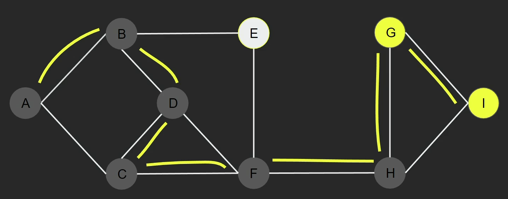
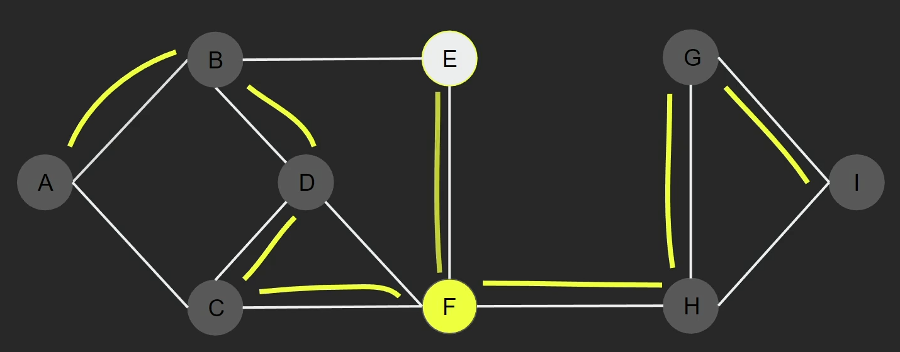
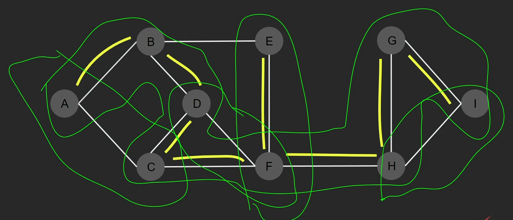

## Depth First Search (DFS)

> One of the <mark>**Graph Traversal Algorithms**</mark>

> - Differs from _BFS_ in the <mark>**traversing**</mark> way.
> - There's <mark>no levels</mark>
> - Works like <mark>**recursion**</mark>, take one way till the end and returning back to take another way <mark>which is unvisited vertices</mark>.
>    returning back to unvisited vertices.  
