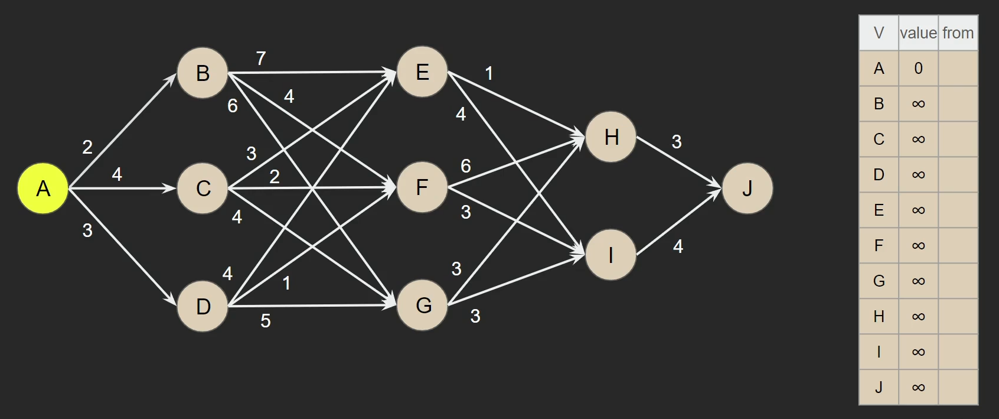

## Dijkstra’s Shortest Path

> As the name suggests, this Algo is intended to find the shortest path, by using **greedy method**, start from a vertex and move to its edges, <mark>**calculate the total length of the first vertex (which is 0) + the edge weight**</mark>

> Initiate a table (array), inside of it put all the vertices, <mark>**0 for the source vertex, and infinity for all the other**</mark>, and finally, which path or vertex that led to each value.

>      And so on ... 
