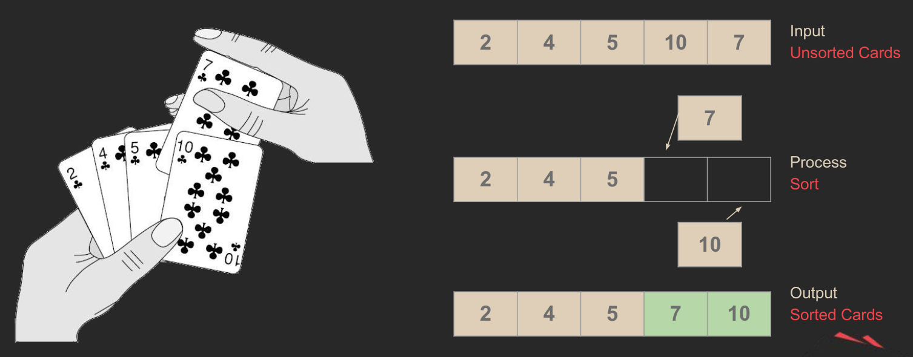
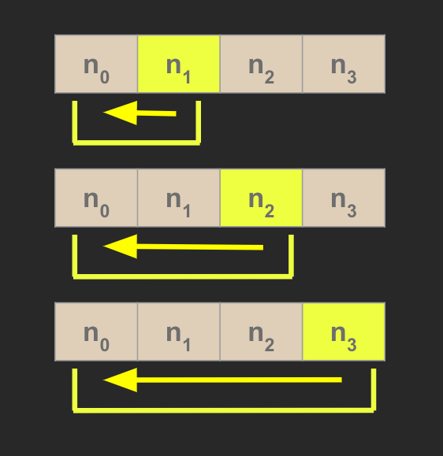
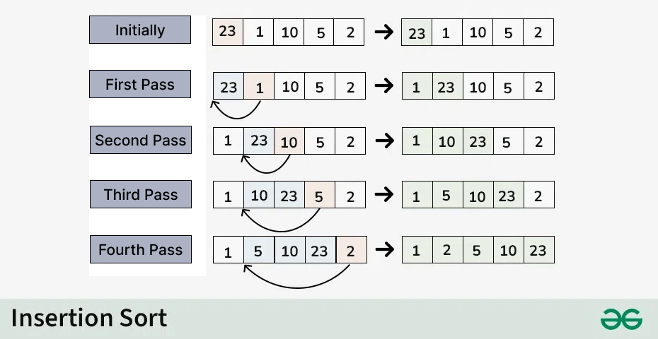
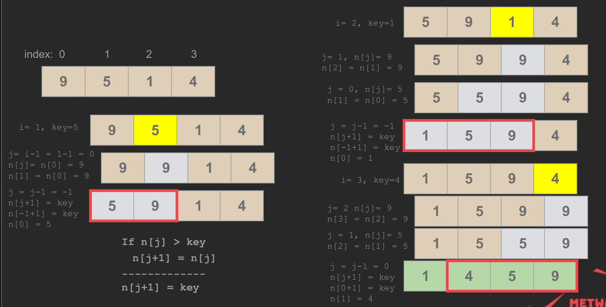
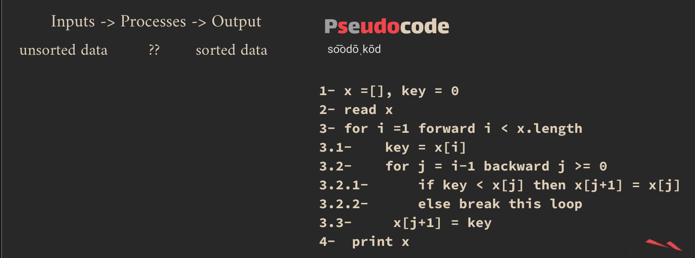
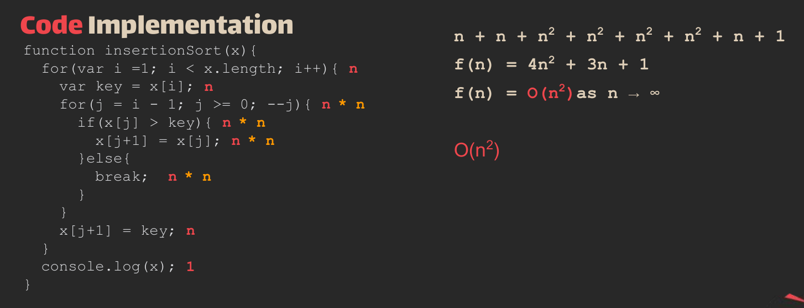
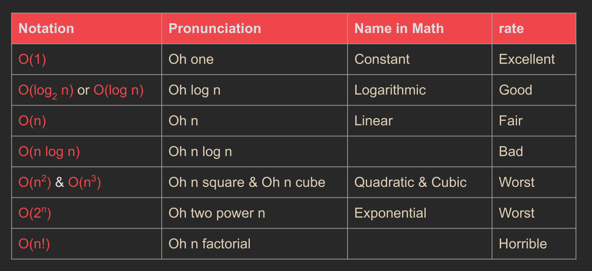

## Insertion Sort

> a simple sorting algorithm that works by iteratively inserting each element of an unsorted list into its correct position in a sorted portion of the list. It is a stable sorting algorithm, meaning that elements with equal values maintain their relative order in the sorted output.

> Insertion sort is like sorting playing cards in your hands. You split the cards into two groups: the sorted cards and the unsorted cards. Then, you pick a card from the unsorted group and put it in the right place in the sorted group.       
