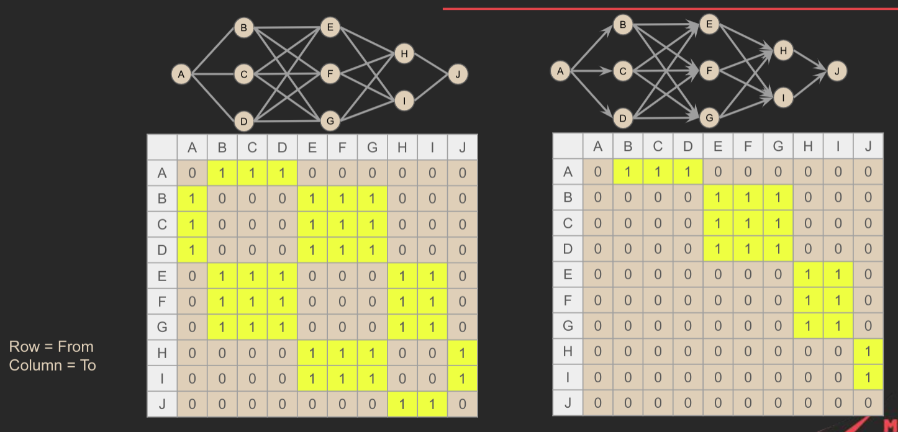
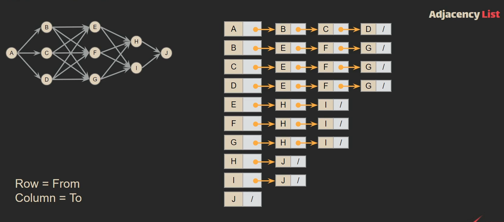

> **a graph is a way to represent a set of objects and the relationships between them.**
>
> - Vertics (Node or Point): _Think of these as points or places. Each node represents an object or entity. For example, in a social network, nodes might represent people._   
> - Edge (Link or Line): _These are the connections between nodes. They represent relationships or interactions between the objects. For instance, in a social network, an edge might represent a friendship between two people._

## Types of Graph

- Null Graph
- Directed Graph
- Undirected Graph
- Connected Graph
- Disconnected Graph
- Complete Graph
- Pseudo Graph

## Graph Applications

- **Maps** (Roads are <mark>Edges</mark>, the points connected by the road are <mark>Vertices</mark>)
- **Social Networks** (relation between friends and likes and share ..)
- **Operating Systems** (process and resources allocated to the process are <mark>Vertices</mark> .. from process to the resourses is <mark>Edge</mark>)
- **Networks** (Computer networks, Electricity networks .. etc)

## Graph Representation

> a graph is a basic concept, but to use it in software, we need to represent it with a specific data structure. We have two main methods for this: the <mark>**adjacency matrix**</mark> and the <mark>**adjacency list**</mark>.

### • Adjacency Matrix

> 
> We use 1 to indicate the presence of a relationship between vertices in the graph. If there is a specific value associated with the relationship, it will replace the 1.

### • Adjacency List

> 
> To represent a graph as a list, we use <mark>an array of linked lists</mark>, where each element in the array is a linked list that represents the connections or edges of a vertex.
