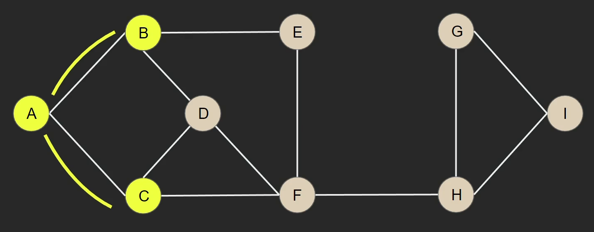
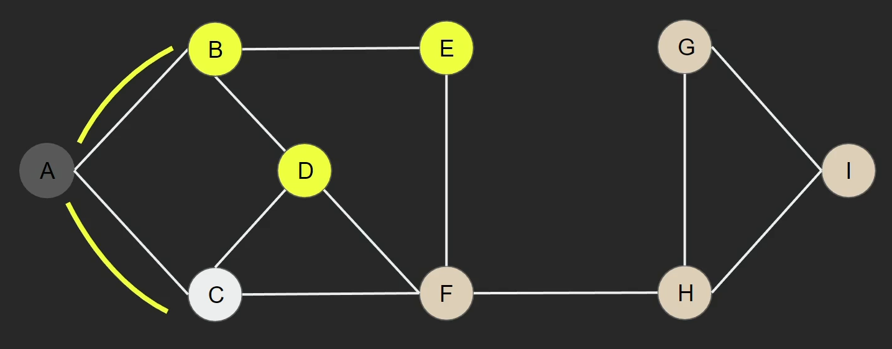
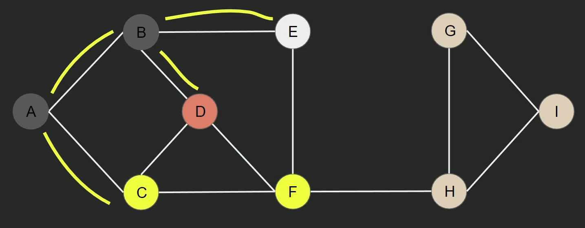
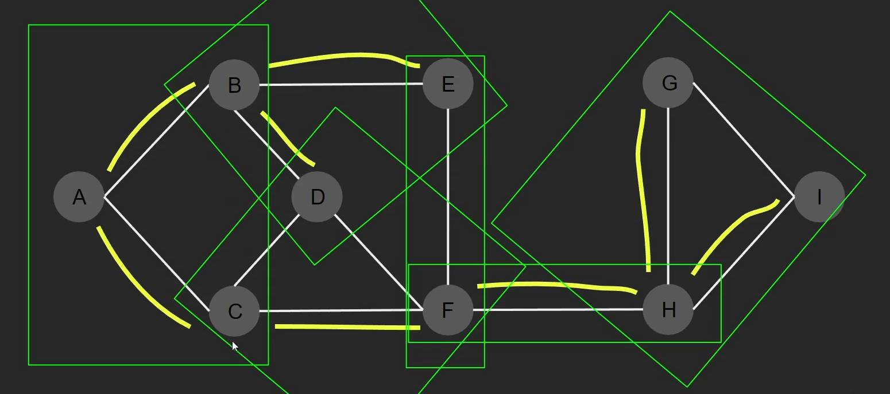
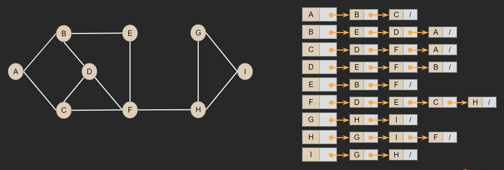
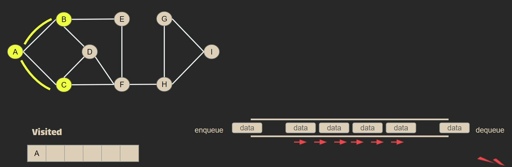
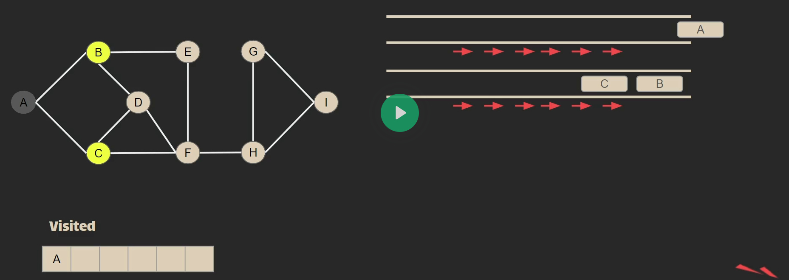
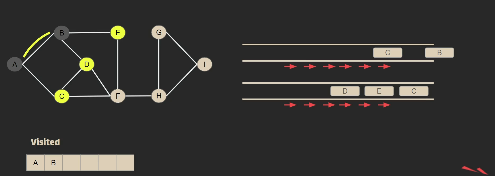
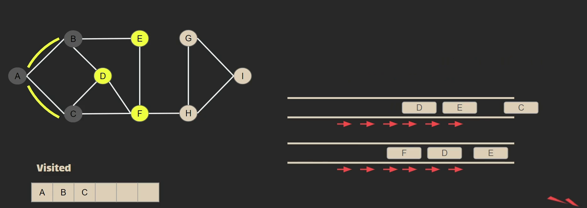

ma# Breadth First Search (BFS)

> One of the <mark>**Graph Traversal Algorithms**</mark>

> Breadth means <mark>**Level**</mark>, which starts searching by levels, finish each level and continue to another. We mainly traverse vertices level by level.

### How it works?

> - Choose one vertex randomly and see what are the vertices it has, finish that level and choose another.
> - The traversing is by visiting each vertex not just one or minimum as in MST, we traverse each vertex at each level.
> - After that, treat each vertex at the current level as a <mark>**Head**</mark> of tree, and the vertex that leads to this level mark that vertex as <mark>**visited**</mark>
> - Do these steps again at each level ...
>      

## Code

> - We'll use <mark>**Adjacnecy List**</mark> not matrix
>   
> - We'll use an <mark>**array**</mark> to store vistited vertices, and use <mark>**queue**</mark> to fill it with the next vertices, each one dequeued will be stored in the visited array.
>      
