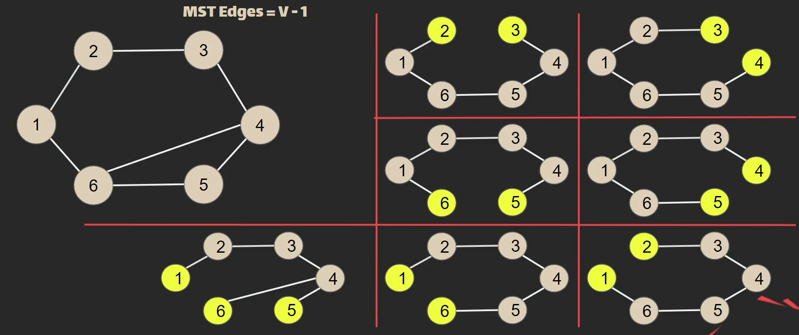
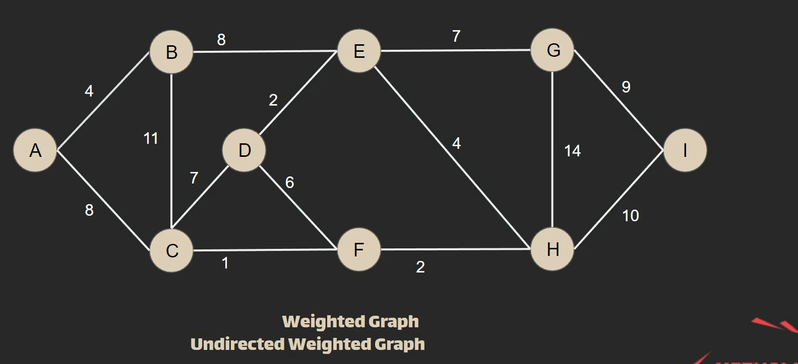
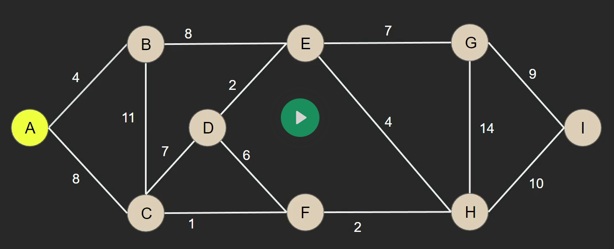
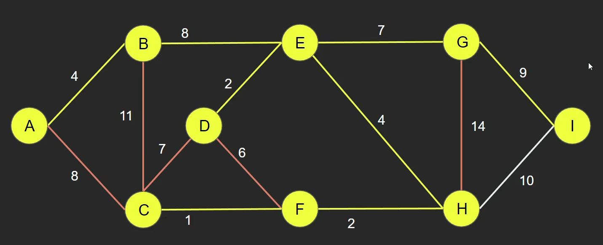
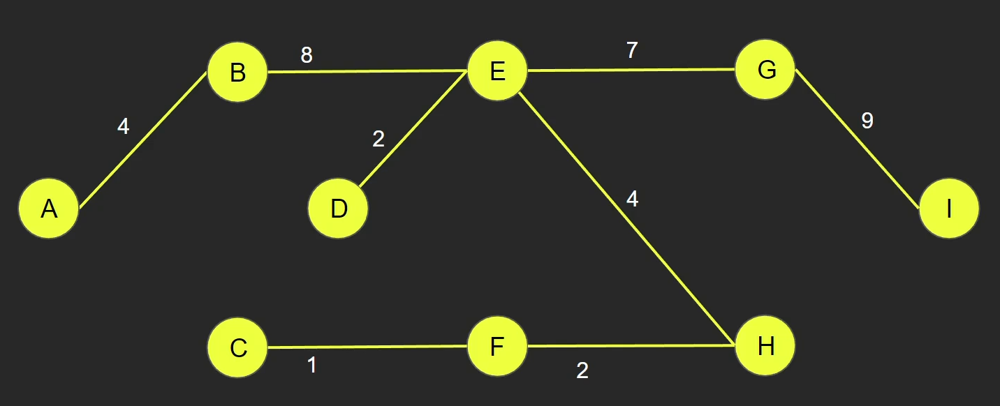
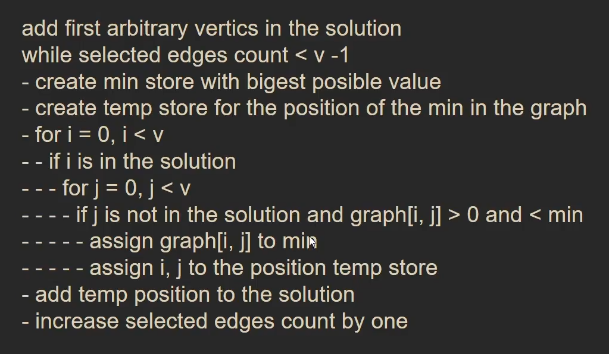
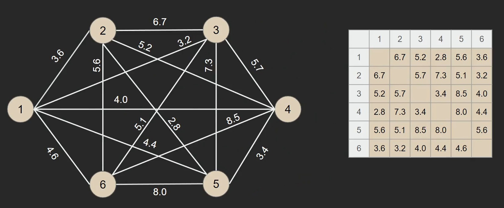

## Minimum Spanning Tree (MST)

> Mininize the graph to have the minimum number of <mark>Edges</mark>, and the Vertices to be connected at the same time (Direct or Undirect).

> [!NOTE]
>
> - MST never have <mark>Cycles</mark>
> - MST Number of <mark>Edges</mark> = Number of <mark>Vertices - 1</mark>

> 

### Undirect Weighted Graph

> 

> 1. Start by choosing the first vertex randomly
> 2. Choose the minimum edge
> 3. From the chosen vertices (which is two so far), choose the minimum edge that's connected directly to them (vertices).

>   

> ### This technique is <mark>**Greedy**</mark>.
>
> We didn't do any calculations to choose, just start from any point and choose the minimum

### The Algorithm

> 

## The used Graph

> 
