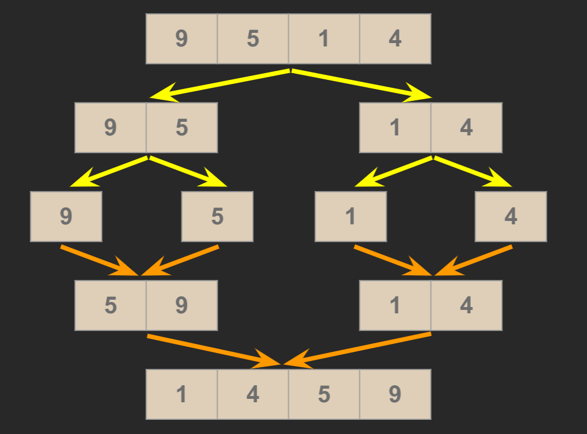
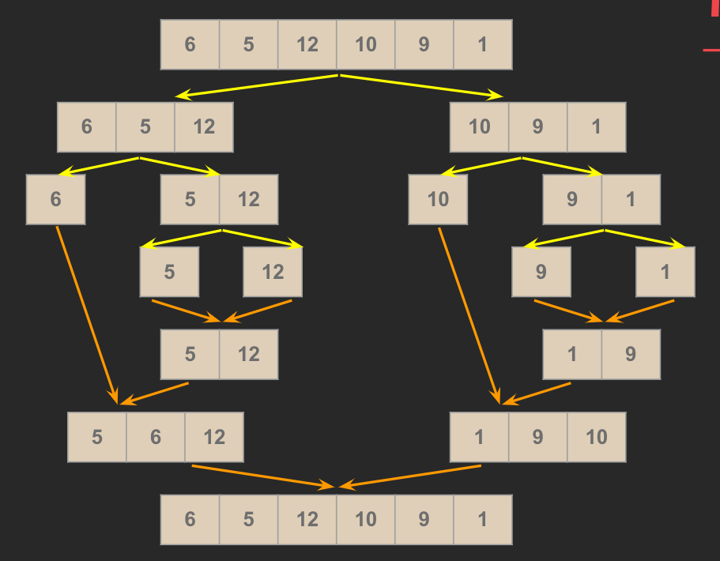
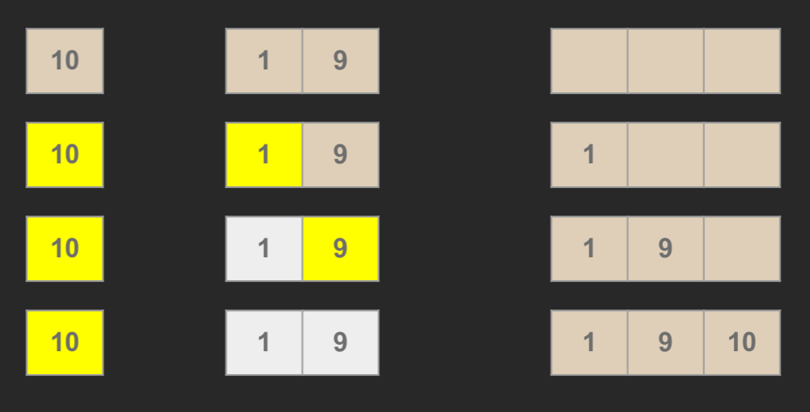
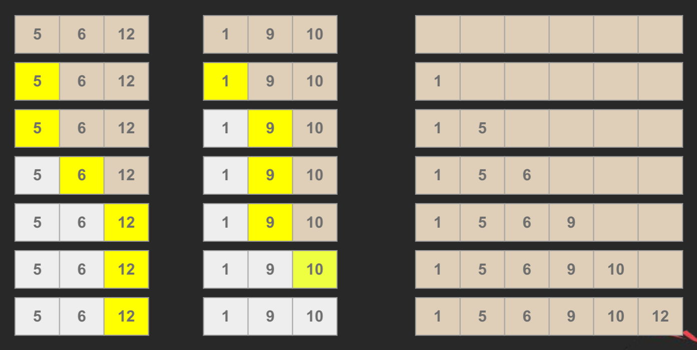
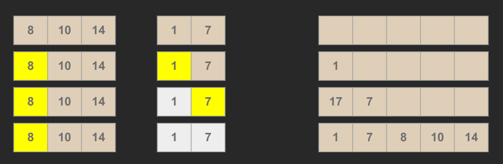
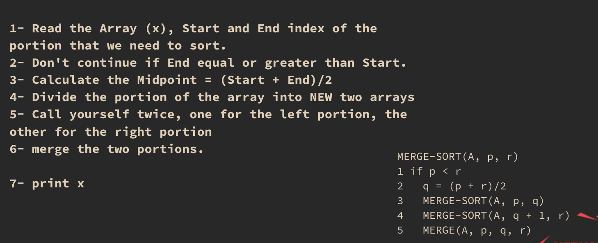
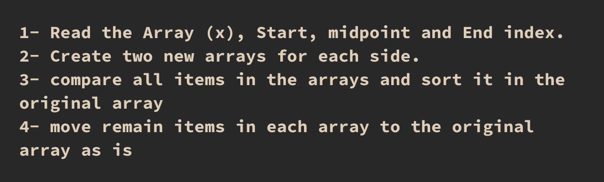

## Merge Sort

> a sorting algorithm that follows the divide-and-conquer approach. It works by recursively dividing the input array into smaller subarrays and sorting those subarrays then merging them back together to obtain the sorted array.

> In simple terms, we can say that the process of merge sort is to divide the array into two halves, sort each half, and then merge the sorted halves back together. This process is repeated until the entire array is sorted.  

## How it works?

>   

## Algorithm

>  <mark>**Merging Algorithm**</mark> 

## Analysis

- Divide & Conquer

  - Recursively
    - Divide
    - Conquer
    - Combine

- Analysis Methods
  - Recursivly-tree-method
  - Master Method (Theorem)
